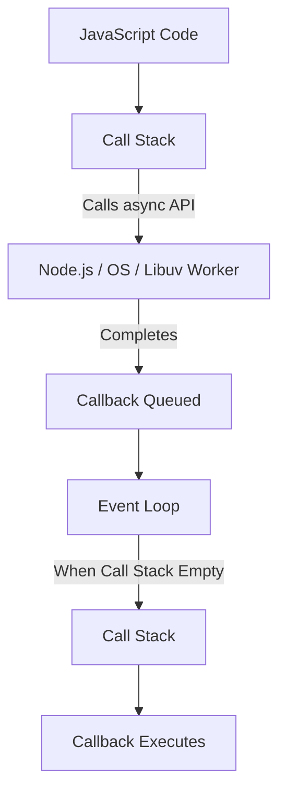

# Event Loop — Notes

## What is the Event Loop?

Node.js executes JavaScript on a **single thread** (the main thread). Despite being single-threaded, it can handle high-concurrency and asynchronous I/O operations without blocking the main thread.

The **Event Loop** is the core orchestration mechanism that offloads operations (such as file I/O, network requests, and timers) to the system kernel or Libuv's thread pool, and continuously pushes ready callbacks back onto the Call Stack when it becomes empty.

---

## High-Level Execution Flow

```text
┌──────────────────────────────────────┐
│           JavaScript Code            │
└──────────────────┬───────────────────┘
                   │
                   ▼
┌──────────────────────────────────────┐
│              Call Stack              │ (Executes synchronous code)
└──────────────────┬───────────────────┘
                   │ Calls asynchronous API
                   ▼
┌──────────────────────────────────────┐
│      Node.js APIs / Libuv / OS       │ (Handles async work in background)
└──────────────────┬───────────────────┘
                   │ Operation completes
                   ▼
┌──────────────────────────────────────┐
│        Callback Becomes Ready        │
└──────────────────┬───────────────────┘
                   │ Placed in queue
                   ▼
┌──────────────────────────────────────┐
│       Queues / Event Loop            │ (Monitors Call Stack & queues)
└──────────────────┬───────────────────┘
                   │ Call Stack is empty
                   ▼
┌──────────────────────────────────────┐
│              Call Stack              │ (Callback pushed to stack)
└──────────────────┬───────────────────┘
                   │
                   ▼
┌──────────────────────────────────────┐
│           Callback Executes          │
└──────────────────────────────────────┘
```



---

## Code Example

```javascript
console.log("1");

setTimeout(() => {
  console.log("2");
}, 0);

console.log("3");
```

### Output:

```text
1
3
2
```

### Why does this happen?
1. `console.log("1")` is synchronous and executes immediately on the **Call Stack**.
2. `setTimeout(..., 0)` registers a timer with the Node.js timer system. Even with a `0ms` delay, its callback is **not** executed immediately—it is offloaded, and its callback is placed in the Timer phase queue once the timer threshold expires.
3. `console.log("3")` executes immediately on the **Call Stack**.
4. The Call Stack is now empty. The Event Loop picks up the expired timer callback from the queue and pushes it onto the Call Stack, printing `"2"`.

---

## Core Components & Queues

| Component | Role | Priority / Notes |
| :--- | :--- | :--- |
| **Call Stack** | Where JavaScript code currently executes (LIFO). | Executes all synchronous code before anything else. |
| **Web / Node.js / Libuv APIs** | Background workers handling asynchronous tasks (I/O, network, timers). | Handled outside the main JavaScript thread. |
| **Microtask Queue** | Holds high-priority callbacks from `process.nextTick()`, Promises (`.then()`, `.catch()`, `.finally()`), and `queueMicrotask()`. | Executed immediately after the current operation and between event loop phases before macrotasks. |
| **Callback Queue / Task Queue** | Holds callbacks for timers (`setTimeout`, `setInterval`), I/O events, and `setImmediate`. | Processed phase-by-phase during the Event Loop tick. |
| **Event Loop** | Continuous coordinator checking if the Call Stack is empty to transfer queued callbacks to it. | The heartbeat of asynchronous Node.js. |

---

## Event Loop Priority Hierarchy

When JavaScript runs asynchronous operations, callbacks are processed in a specific order:

```text
1. Synchronous Code (Call Stack)
       ↓
2. process.nextTick() Queue (Microtask - Highest Priority)
       ↓
3. Promise Microtask Queue (.then, .catch, queueMicrotask)
       ↓
4. Macrotask Phases (Timers → I/O Poll → Check/setImmediate → Close)
```