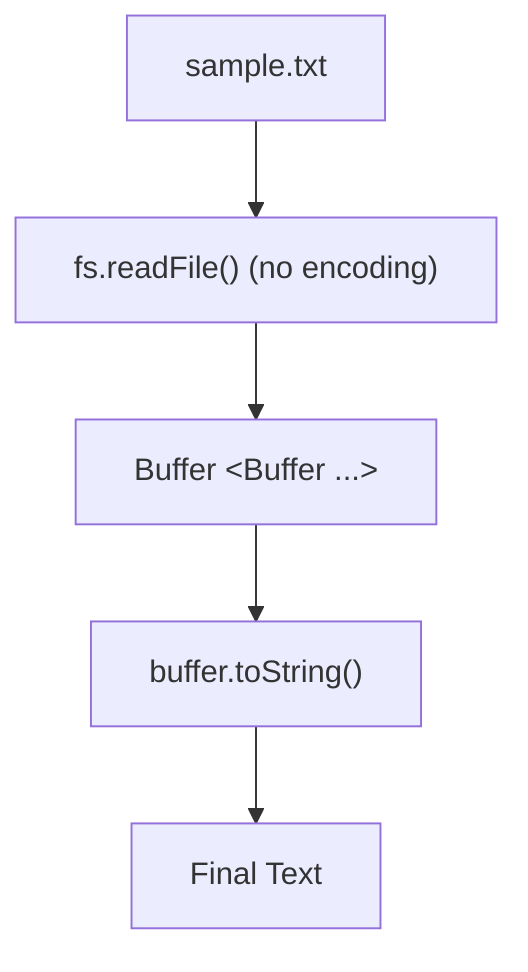

# Buffers — Practice Tasks

## Task 1: Basic Buffer

### Objective
Create a buffer from a string and explore its fundamental properties.

### Instructions
1. Create a Buffer initialized with the string `"Hello Node.js"` using `Buffer.from()`.
2. Print the following:
   - The raw Buffer instance
   - The length of the buffer (`buffer.length`)
   - The decoded string (`buffer.toString()`)

### Methods to Use:
- `Buffer.from()`
- `buffer.length`
- `buffer.toString()`

---

## Task 2: Inspecting Raw Bytes

### Objective
Understand how Buffers store individual bytes in memory.

### Instructions
1. Create a Buffer from the string `"ABC"`:
   ```javascript
   const buffer = Buffer.from("ABC");
   ```
2. Print:
   - The first byte (`buffer[0]`)
   - The second byte (`buffer[1]`)
   - The third byte (`buffer[2]`)
3. **Concept Question**: Explain why `buffer[0]` outputs a number (like `65`) instead of the string character `"A"`.

---

## Task 3: File to Buffer (`fs.readFile`)

### Objective
Read a file into memory as raw binary data and decode it into text.

### Instructions
1. Create a text file named `sample.txt` with sample text content.
2. Read the file using `fs.readFile()` **without specifying any encoding**.
3. Observe and understand the data flow:

```text
┌─────────────────┐
│   sample.txt    │
└────────┬────────┘
         │
         ▼
┌─────────────────┐
│  fs.readFile()  │ (No encoding passed)
└────────┬────────┘
         │
         ▼
┌─────────────────┐
│     Buffer      │ (<Buffer ...>)
└────────┬────────┘
         │
         ▼
┌─────────────────┐
│buffer.toString()│ (Decodes binary bytes to UTF-8 string)
└────────┬────────┘
         │
         ▼
┌─────────────────┐
│    Final Text   │
└─────────────────┘
```



4. Print both the raw Buffer and the final decoded text.

---

> [!TIP]
> Once you can do these 3 tasks, your understanding of Buffers is solid → next up: **Streams**!